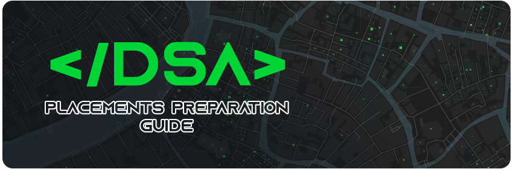

- **You are never too late :clock12:.** Start your preparation as soon as possible to have an edge over others.

- Try to start your preparation in your 2nd year itself as it can help crack the on-campus internships which have greater chances of getting converted to PPO and you can concentrate on other things during the placement season.

- Try to do **minimum :three::five::zero:**+ questions (good quality). Preferably concentrate more on medium-level questions. Be consistent and solve questions every day.

- Be thorough in at least **:one:** language (C++ or Java or Python). If you are going ahead with Python, try to have a backup language (either C++ or Java) in which you know the basics of coding as some companies do not allow Python but it is very rare. The main reason is that many codes might give TLE in Python and the same code in other languages would work perfectly. **I have added few codes in Python as I could not find a single place where the solutions for various questions are in Python. I will try to add more solutions in the future.**

- Make sure you know Java and C++ to understand the basic syntax as many technical MCQs are based on these languages.

- If possible, do the daily problems on [Leetcode](https://leetcode.com/explore/featured/card/august-leetcoding-challenge-2021/) and [GFG](https://practice.geeksforgeeks.org/problem-of-the-day).

- Have a clear idea if you want to pursue masters or sit for placements if your university doesn't allow you to reject on-campus offers.

- Know and adhere to all the rules of your campus placement cell to avoid getting into trouble.

- Make a habit of checking your emails from time to time. If you miss out on an important mail, you may regret it later.

- Talk to like-minded people and share resources with each other. **Don't be greedy :x:.**

- Try to make a group with friends who solve questions consistently. Discuss your solutions with each other to understand various approaches for the same question.

- The placement season can be very stressful. You might face many rejections but don't give up. Try to have enough sleep and balance everything else as well. **Luck matters a lot during placements**.

- Your **CGPA** matters a lot for getting shortlisted. Once you are shortlisted, give it your all to clear the coding and interview rounds.

:large_blue_circle:*Note: Other tips on technical and management-related placements and higher studies (Masters) would be added in the future.*

## Data Structures and Algorithms to practice :triangular_flag_on_post:
- Arrays
- Linked List
- Stack
- Hashing
- Queue
- Strings
- Bit Magic
- Sorting (Various algorithms)
- Searching (Binary Search - important)
- Sliding Window
- 2 or n-pointer approaches
- Backtracking
- Greedy
- Trees (Binary Trees, BST)
- Heaps
- Recursion (Do this before DP)
- DP (For Top Companies)
- Graphs (For Top Companies)

## Resources :memo:
### Sheets and Quality Questions :green_book:
- [Love Babbar - DSA 450 Sheet](https://drive.google.com/file/d/1FMdN_OCfOI0iAeDlqswCiC2DZzD4nPsb/view) | [DSA 450 Tracker](https://450-dsa-tracker.netlify.app/) | [450DSA](https://450dsa.com/)
- [Striver - SDE Sheet](https://docs.google.com/document/d/1SM92efk8oDl8nyVw8NHPnbGexTS9W-1gmTEYfEurLWQ/preview?pru=AAABe4GAo70*4StOWEVxAxVhQj02RA1FhA)

- [GFG Must Do Interview Preparation Questions](https://practice.geeksforgeeks.org/courses/must-do-interview-prep?vC=1)

- [Leetcode Top Interview Questions - Easy, Medium & Hard](https://leetcode.com/explore/interview/card/top-interview-questions-easy/)

- [CSES Competitive Programmer’s Handbook](https://cses.fi/book/book.pdf)

- [Extra Resources](https://anubhavsinha98.medium.com/resources-to-master-data-structures-and-algorithms-24450dc6d52b)

### Youtube :tv:
- [Aditya Verma](https://www.youtube.com/channel/UC5WO7o71wvxMxEtLRkPhiQQ) - DP and Recursion (His other playlists are good as well)

- [Striver](https://www.youtube.com/channel/UCJskGeByzRRSvmOyZOz61ig) - SDE Sheet solutions (Graphs and other playlists are good as well)

- [Anuj Bhaiya](https://www.youtube.com/playlist?list=PLUcsbZa0qzu3yNzzAxgvSgRobdUUJvz7p) - The DSA One Course (Good DSA Videos, his other playlists are too helpful)

- [GFG Data Structures and Algorithms Course](https://practice.geeksforgeeks.org/courses/dsa-self-paced) (Buy it only if you can afford it. Covers most of the basic foundations and is worth the money :heavy_dollar_sign:. You can do well with online free resources as well.)

- [Codebasics - Python 3 Programming Tutorials for Beginners](https://youtube.com/playlist?list=PLeo1K3hjS3uv5U-Lmlnucd7gqF-3ehIh0)

## Platforms :key:
Do check out the solutions, editorials, and discussion once you solve or cannot solve the problem to understand the various approaches.
- [Hackerrank](https://www.hackerrank.com/) (Basics)
- [GFG](https://practice.geeksforgeeks.org/explore/?company%5B%5D=Amazon&problemType=functional&page=1&sortBy=submissions&company%5B%5D=Amazon) (Medium to Advanced) - Recomended
- [Leetcode](https://leetcode.com/explore/) (Medium to Advanced) - Recomended
- [CSES Problem Set](https://cses.fi/problemset/) (Medium to Advanced)
- [Codechef](https://www.codechef.com/) (Advanced)
- [CodeForces](https://codeforces.com/) (Advanced)

## Theory (Interview POV and Practice Resources) :notebook:
GFG Last Minute Notes are more theoretical and contain only text generally. I prefer Interviewbit as they have both textual and pictorial representation which is better for understanding.

Try to cover all the resources for each theory topic.

If you have enough time, check out the interview questions based on your domain on Interviewbit. They have interview questions for Data Science, Machine Learning, Cloud, Node, etc. which can be helpful.

If you want extra questions or resources, check out: [Striver Code Sheet](https://docs.google.com/document/d/1sQlRDw6--HwyxeFL7b4kBsOG-Tz7rXMbpWNnfvJErA4/edit) or [Love Babbar Roadmaps](https://youtube.com/playlist?list=PL4PCksYQGLJMtEI_0y0FWf3dz1DzB_2KU)

### DBMS :minidisc:
To practice SQL questions, you can try [Leetcode Database Problems](https://leetcode.com/problemset/database/?page=1) and [HackerRank](https://www.hackerrank.com/domains/sql)

  
Tips and resources:

  <ul>
  <li>YouTube videos:
  <ul>
  <li><a href="https://www.youtube.com/watch?v=7S_tz1z_5bA">Programming with Mosh - MySQL Tutorial for Beginners (For Basic topics)</a></li>
  <li><a href="https://www.youtube.com/watch?v=HXV3zeQKqGY">freeCodeCamp.org - SQL Tutorial (For Basic topics)</a></li>
  <li><a href="https://www.youtube.com/watch?v=M-55BmjOuXY">Simplielearn - SQL Advanced Tutorial (For Advanced topics)</a></li>
  </ul>
  </li>
  <li>Important Concepts:
  <ul>
  <li>Basic DML and DDL statements</li>
  <li>Joins</li>
  <li>Views</li>
  <li>Ranking</li>
  <li>Top nth (Using limit and offset)</li>
  <li>Sub Queries</li>
  <li>Indexing</li>
  <li>Sharding basics</li>
  <li>Relationship</li>
  <li>Normalization</li>
  </ul>
  </li>
  </ul>

 

- [GFG LMS](https://www.geeksforgeeks.org/last-minute-notes-dbms/)
- [Interviewbit](https://www.interviewbit.com/dbms-interview-questions/)
- [Interviewbit - SQL](https://www.interviewbit.com/sql-interview-questions/#questions)
- [Javatpoint](https://www.javatpoint.com/sql-interview-questions)

### OOPS :closed_lock_with_key:
**Note: OOPs concepts differ from language to language.**

  
Tips and resources:

  <ul>
  <li>Try to go through YouTube videos to understand all the basic concepts of OOPs.</li>
  <li>If you are coding in Python, I would recommend these:
  <ul>
  <li><a href="https://www.youtube.com/watch?v=qiSCMNBIP2g">Telusko - OOPs in Python</a></li>
  <li><a href="https://www.youtube.com/watch?v=TFLo9m0jFEg"> ProgrammingKnowledge - Python Tutorial for beginners from video 27 to 35 & 50</a></li>
  <li>
  <a href="https://www.youtube.com/watch?v=FDdfGFhY9Ms"> edureka! - Python Encapsulation</a>
  </li>
  <li>Know the differences of OOPs concept implementation in Python and Java.</li>
  </ul>
  </li>
  <li>Some important OOPs concepts:
  <ul>
  <li>Class</li>
  <li>Object</li>
  <li>Constructors and Destructors</li>
  <li>Polymorphism (Overloading and Overriding)</li>
  <li>Inheritance</li>
  <li>Encapsulation</li>
  <li>Abstraction</li>
  </ul>
  </li>
  </ul>

 

- [Interviewbit](https://www.interviewbit.com/oops-interview-questions/)
- [Javatpoint](https://www.javatpoint.com/oops-interview-questions)

### OS :computer:
- [GFG LMS](https://www.geeksforgeeks.org/last-minute-notes-operating-systems/)
- [Interviewbit](https://www.interviewbit.com/operating-system-interview-questions/)
- [Javatpoint](https://www.javatpoint.com/operating-system-interview-questions)

### Networking :e-mail:
- [GFG LMS](https://www.geeksforgeeks.org/last-minute-notes-computer-network/)
- [Interviewbit](https://www.interviewbit.com/networking-interview-questions/)
- [Javatpoint](https://www.javatpoint.com/networking-interview-questions)

## Aptitude :bar_chart:
- [IndiaBix](https://www.indiabix.com/) - Recomended (Go through the important formulas for each topic)
- [CareerRide](https://www.youtube.com/playlist?list=PLpyc33gOcbVA4qXMoQ5vmhefTruk5t9lt) - Solve types of questions and make a formula sheet
- [Coding Ninjas](https://www.codingninjas.com/codestudio/guided-paths/aptitude-preparation)

## Reasoning :brain:
- [CareerRide](https://www.youtube.com/playlist?list=PLpyc33gOcbVADMKqylI__O_O_RMeHTyNK)
- [IndiaBix](https://www.indiabix.com/logical-reasoning/questions-and-answers/)

## Puzzles :trophy:
- [Normal (GFG)](https://www.geeksforgeeks.org/puzzles/)
- Guesstimates

## Interview Tips :clipboard:
- Read interview experiences from GFG or elsewhere before every test or interview as the questions repeat sometimes and you will have a rough idea which will narrow down on the topics to prepare.

- If you know about your interview panel, check out their profiles on LinkedIn (anonymously) and concentrate more on the projects which clash with their domain of expertise as they can go deep while asking questions.

- While answering any DSA problem during an interview, start with the brute force approach and eventually optimize your code even if you know the optimized approach. Don't waste much time on brute force if you already know the best approach.

- Don't act if you don't know the answer to any question.

- Be confident while answering and keep smiling throughout the interview.

- Prepare a short introduction about yourself which can be told in 1 or 2 minutes. Be prepared with this because if you think during the interview it would leave a bad impression.

- Make sure you start and end the interview on a good note. Thank the interviewer(s) at the end.

- Know the basic things for the managerial or HR round like about the company, why do you want to join them, how would you contribute, your future aim, situational questions. Try to be genuine and natural.

- Dress up properly.

  
Resume

  <ul>
  <li>Work properly a day or two on your resume.</li>
  <li>Make sure your resume is in either PDF or Word Dcoument format and the text can be copied by dragging (The text cannot be copied if your resume is an image if you make it in photoshop).</li>
  <li>Mention projects and attach a link if it is hosted or has a github repo.</li>
  <li>Proof Read</li>
  <li>Don't mention unnecessary stuff. Mention only those skills and projects which you actually know.</li>
  <li>Don't worry if you have a mediocre resume, concentrate more on your preparation.</li>
  <li>If you have done any internship(s) then that's good, else it is fine. Won't matter in an interview if you can answer everything.</li>
  <li>You can use <a href="https://resumeworded.com/">Resume Worded</a> for better resume making tips.</li>
  <li>You can use <a href="https://www.overleaf.com/">Overleaf</a> or <a href="https://www.canva.com/">Canva</a> for making your resume.</li>
  </ul>

 

  
Projects

  <ul>
  <li>Try to make unique projects.</li>
  <li>Host your projects if possible.</li>
  <li>Be thorough with all the concepts in your project.</li>
  <li>Go through your projects and make sure they are working prior to your interviews.</li>
  </ul>

 

# Contributors :fire:
 - [Belide Aakash](https://www.linkedin.com/in/belideaakash/)
 - [Amanpreet Taluja](https://www.linkedin.com/in/amanpreet-taluja-a14822216/)
 - [Apnik Jain](https://www.linkedin.com/in/apnik-jain/)
 - [Umang Agarwal](https://www.linkedin.com/in/umang-agarwal-5b227617b)

 

Other Contributors:
 - [Sarthak Verma](https://linkedin.com/in/sarthakv/) - DSA450 Extra tracker and DSA Playlist
 - [Mihir Bhasin](www.linkedin.com/in/mihir-bhasin-3906bb185) - Extra resources for aptitude and reasoning

 **:red_circle:Note: All the above-mentioned tips are based on our personal views and experiences. This is just to help you out with your preparation and doesn't guarantee that you will be placed. We are not responsible for anything.**

Star :star: this repo if you like it.

<b>Good luck with your preparation &#128077<b>

